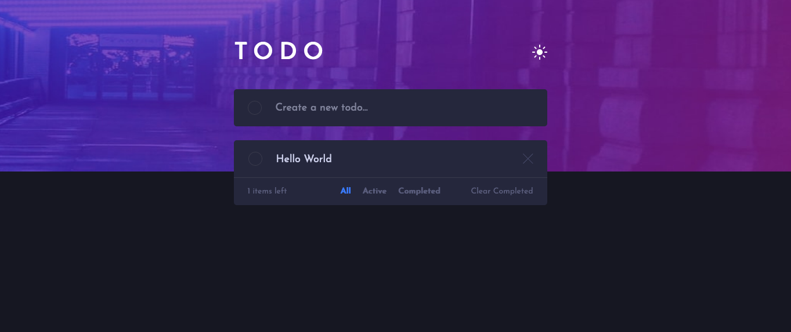

# Frontend Mentor - Todo app solution

This is a solution to the [Todo app challenge on Frontend Mentor](https://www.frontendmentor.io/challenges/todo-app-Su1_KokOW). Frontend Mentor challenges help you improve your coding skills by building realistic projects.

## Table of contents

- [Overview](#overview)
  - [The challenge](#the-challenge)
  - [Screenshot](#screenshot)
  - [Links](#links)
- [My process](#my-process)
  - [Built with](#built-with)
  - [What I learned](#what-i-learned)

## Overview

### The challenge

ユーザーができること:

- デバイスの画面サイズに応じて、アプリの最適なレイアウトを表示します
- ページ上のすべてのインタラクティブ要素のホバー状態を確認する
- 新しい todo をリストに追加する
- Todo を完了としてマークする
- リストから todo を削除することができる
- all/active/complete で Todo リストをフィルタリングできる
- 完了した Todo をクリアできる
- ライトテーマとダークテーマを切り替えられる Toggle light and dark mode

### Screenshot



### Links

- Solution URL: [リンク](https://github.com/Kaji1127/todo-app)
- Live Site URL: [リンク](https://react-todolist-appli.netlify.app/)

## My process

### Built with

- CSS custom properties
- Flexbox
- CSS Grid
- Sass
- Mobile-first workflow
- React - JS library

### What I learned

useContext, useReducer を使ってテーマを切り替えするようにした

コードスニペット:

```js
const ThemeContext = React.createContext();

const initialState = {
	theme:
		localStorage.getItem('theme') == null
			? 'dark-theme'
			: localStorage.getItem('theme'),
};

const themeReducer = (state, action) => {
	switch (action.type) {
		case 'LIGHT_THEME':
			return { theme: 'light-theme' };

		case 'DARK_THEME':
			return { theme: 'dark-theme' };

		default:
			return state;
	}
};

export const ThemeProvider = ({ children }) => {
	const [state, dispatch] = useReducer(themeReducer, initialState);

	useEffect(() => {
		localStorage.setItem('theme', state.theme);
	}, [state.theme]);

	return (
		<ThemeContext.Provider value={{ state, dispatch }}>
			{children}
		</ThemeContext.Provider>
	);
};

export default ThemeContext;
```

### Useful resources

- [リソース 1](https://www.section.io/engineering-education/dark-mode-for-react-app-using-context-api-and-hooks/) - useReducer と useContext を使ったテーマの切り替え方を学んだ。
